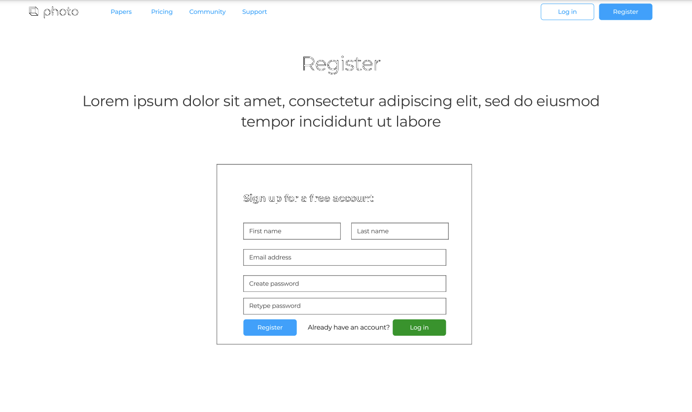
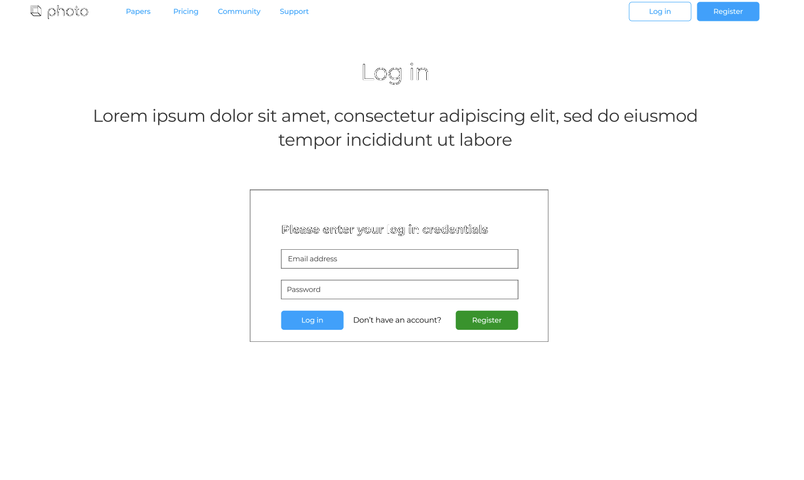
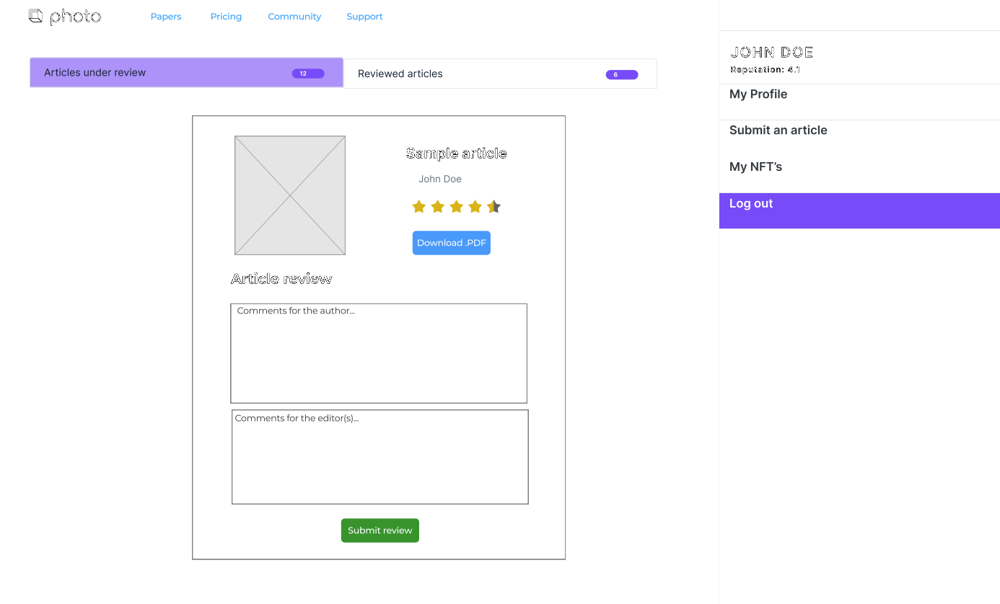
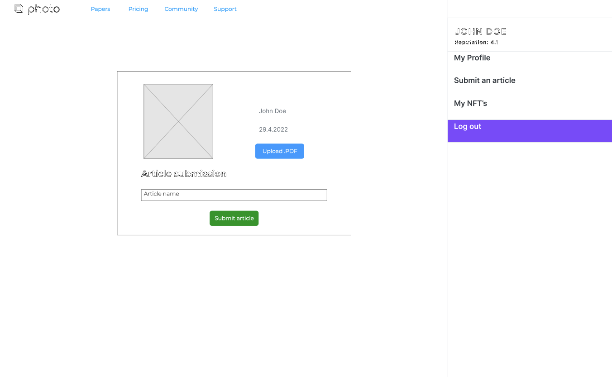
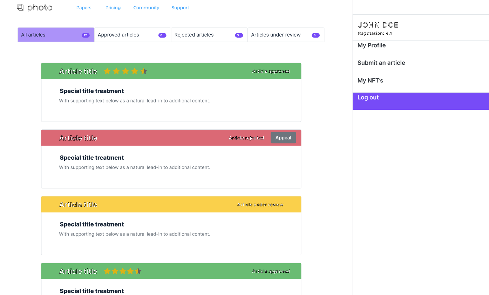
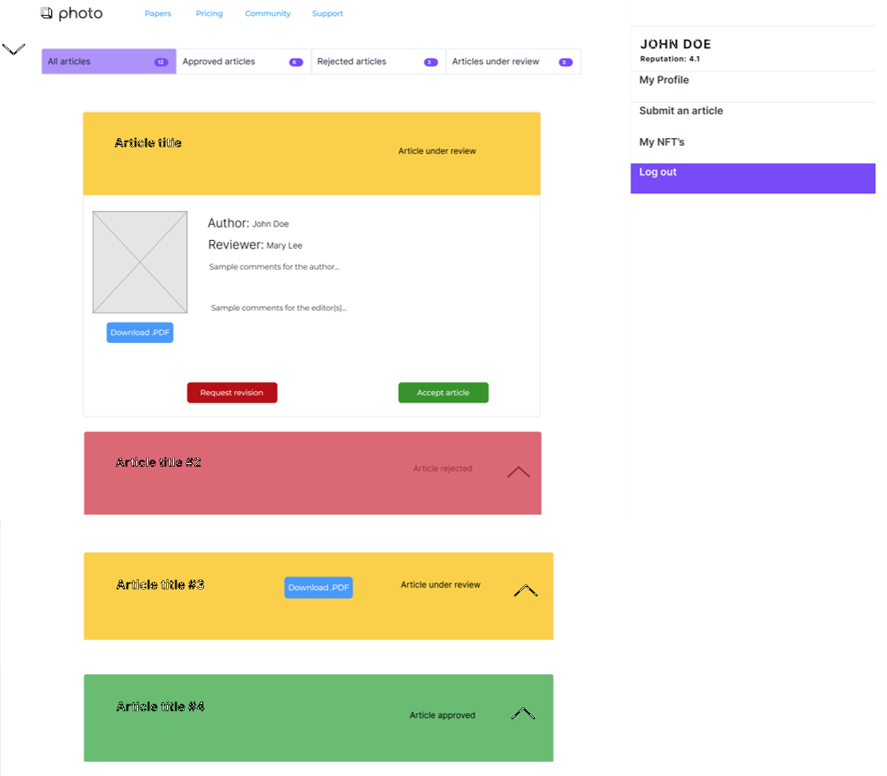
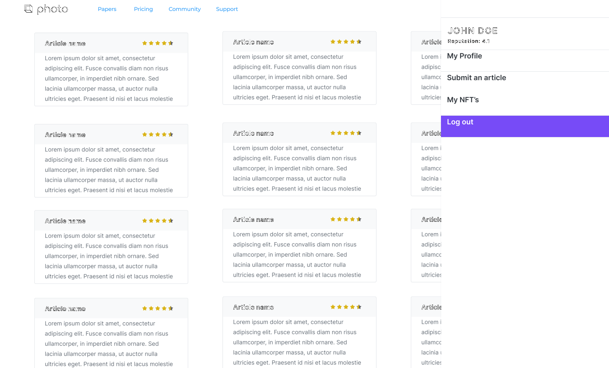
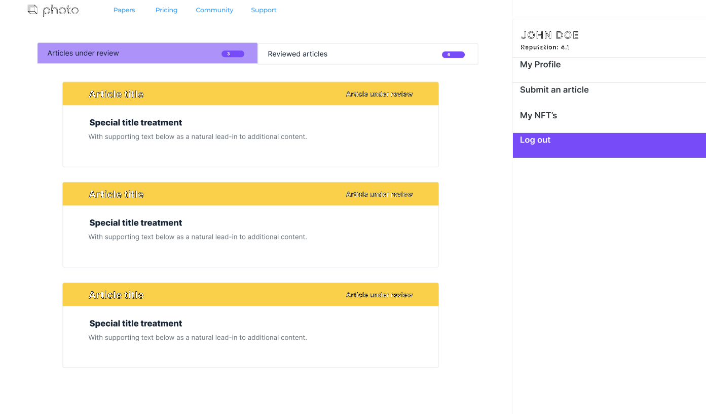
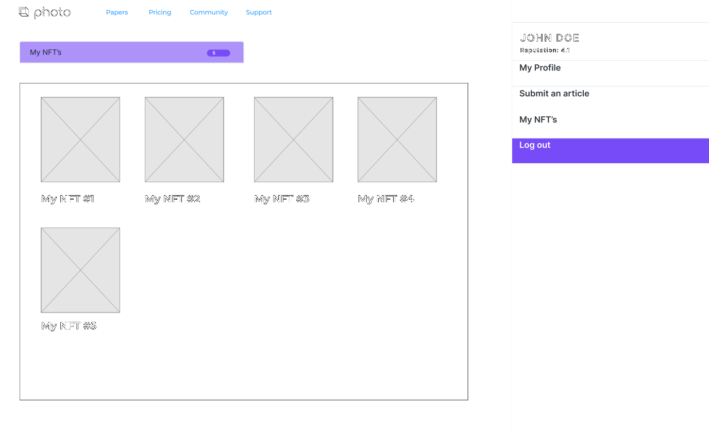

# Frontend

### Students assigned for task
Nino Brezac  
Ivo Pajer

### Technology stack

- Initial wireframes will be drawn using the [**figma**](https://www.figma.com/file/QpOCLisvpVy4pUhfmpE5yX/FOG?node-id=0%3A1) online wireframe tool
- The frontend will have a classic web app form (**HTML/CSS/JS stack**)
- Frontend will be implemented using Angular framework (possible shift to React if **Angular** proves too dificult)
- **Bootstrap library** will be used, as it speeds up the design process and allows creation of fast responsive sites with a clean design
- **Web3JS** will be used to connect with the backend

Any further inclusion of libraries and frameworks will be promptly recorded here.

### Main objectives/requirements:

- Creation of a functional frontend, that is successfully connected with all backend services
- Creation of a responsive frontend, that adapts well to different screen sizes
- Clean design of frontend

### Wireframes:

Thoughtful frontend design almost always starts with the creation of wireframes, initial ideas and drawings. This gives a clearer vision of the end product and should tackle potential design challenges and misunderstandings much earlier. This makes coding easier and drastically reduces the amount of excess code.

### List of tasks:

The main design phases we planned are:
1. **Wireframe creation** - create wireframes, initial designs, get input and feedback from colleagues
2. **Static frontend design** - create first frontend drafts in Angular, with static data
3. **Integration** - connect existing frontend with all necessary backend microservices

### Task progress/rationale
Tasks above the horizontal line are finished or in progress.  
Tasks below the line are to be done in the future.  
Current wireframe progress is available on [**figma**](https://www.figma.com/file/QpOCLisvpVy4pUhfmpE5yX/FOG?node-id=0%3A1).
1. **Wireframe creation** 
    - Register 
    
   
    - Log-in     
    
    
    - Article review (reviewer)     
    
    
    - Article voting (reviewer) - WIP
   
    - Article submission (author)  
    
    
    - Articles overview (author)  
    
    
    - Articles overview (editor)  
    
    
    - Assign reviewers (editor) - WIP
    - Articles overview (reader)   
    
    
    - Articles overview (reviewer)  
    
    
    - User profile - WIP
    
    - My NFT's  
    
    ---

2. Static frontend design - TODO
3. Integration - TODO

The list will be updated as progress will be made, or as new tasks are born.