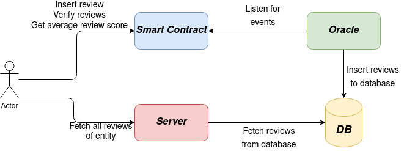

# Reputation system

## Design decisions
The design of the system was made by taking into consideration the discussion made in [1] and after reading the solution proposed in [2]:
1. *Storage*: we want to store as little data as possible on the blockchain. Therefore, we decide to have a database, that will store the text of the review, while we will keep on the blockchain only the hash value of the text, along with the actual score (integer value between 1 and 5) and the address of the entity, to which the review refers to. The hash is computed with the SHA-256 algorithm, by setting as the input the text string. For example, a hash of a review might be: 
   
   ```SHA256('the article is really illuminating') = 4f4a5e8a05fdd82aab3b8c2742286b83dc40417e248e77606a09b472290f700c```
   
   Users will be able to fetch the complete content of the reviews (including the text) only from the database by means of an external server, which we will manage. To compensate for this centralization, the reputation smart contract will allow to verify the reviews the user will submit. The pipeline is therefore the following:
      * when a user wants to insert a review, he sends it to the smart contract;
      * when a user wants to get the average reputation value, he sends a request to the smart contract;
      * when a user wants to get all the reviews of an entity, he sends a request to the server. Optionally, if the user wants to verify that the received reviews have not been tampered with, he can send the list of reviews received from the server to the smart contract, which will verify that the texts and the scores match with the hashes and scores, that are stored on the blockchain. If the check fails, i.e. if the hashes of the reviews received by the smart contract do not match with the values stored by the smart contract, there is a problem in the server - either it is compromised or there is a bug. Nevertheless, the user will still be able to trust the average score received from the blockchain, or he can directly obtain a list with only the scores from the blockchain.
  
2. *Computation*: the computations that can be performed on the blockchain need to be deterministic. This fact, coupled with the finite precision of real number representation with binary values, prevents us from using exponents, logarithms, and many other functions, which we might consider when computing the final reputation of the entity - see [1] for a more detailed discussion. Nevertheless, we decide to compute the reputation on the blockchain so to have always the true reputation value computed on the blockchain. The final reputation is simply the average and, as we are limited to integer algebra, we return the average score as two values: the first returned value is the integer score (between 1 and 5) rounded down, and second is decimal place of the average score, again rounded down. In other words, if the exact average score is $\pi$, the returned values will be $(3, 1)$. Conversly, if the values received are $(4, 2)$, the user knows, that the true value is in the range $[4.2, 4.3)$. It might be argued that this is not very precise, but analyzing other online stores, such as Amazon, we notice, that the average reputation scores are typically given with $0.1$ precision.
3. *Storing data to the database*: the data will be inserted to the database by a centralized oracle we will manage. We might argue that this centralization (centralized oracle and database) undermines some of the robustness of the system, but we decided to take this road as on one hand, the data that is available on the database is not crytical (only the text of the review, while the score of the review is either way stored on the blockchain), and on the other hand because this will allow us to fetch the data much faster and provide a better user experience.

A general overview of the architecture is depicted in the image below. Note that the arrows point from the entity starting the interaction to the entity that is expected to respond.


### Benefits
* The blockchain is used to store hashes of the reviews, so that users can verify that the review has not been altered after it was inserted;
* The reviews get inserted directly to the blockchain with no intermediary, so we can be sure about their thruthfulness;
* The reputation scores are always up to date - see [1] for a thorough discussion of the pros and cons of both the proactive and reactive approaches in computing the reputation on the blockchain.

## Methods of the smart contract
* `storeReview(address _targetEntity, uint8 _value, string memory _text)`: this method inserts a new review which refers to the entity identified with the address `_targetEntity`. First it is checked, whether the `msg.sender` is allowed to insert a review about `_entity`, then the internal data structures are updated and finally an event is emitted. This event is captured by an oracle, which inserts the data to the database.
* `retrieveEntityReviews(address _targetEntity)`: returns an array of all the reviews received by the entity `entity`. The returned value is an array tuples of the form `[(score, hash, id)]`.
* `getReputationCount(address _entity)`: returns the number of reviews which refer to the entity `_entity`. Note: if the return value is $0$, it means that either the entity does not exist or that it exists but has no reviews associated with it;
* `checkEntityReviews(uint8[] memory _assertedScores, bytes32[] memory _assertedHashes, address _targetEntity)`: verifies that the sequence of scores and hashes referred to the `_targetEntity` matches with the provided ones. Note: the scores and hashes need to be sorted by their ID in increasing order (i.e. in the order returned by the server);
* `getAverageScore(address _targetEntity)`: returns a tuple of values that represent the actual average score.

## Local development

To test locally, follow the following steps:
1. Deploy a MySQL database. The database serves to store all the text contained in the reviews, other review data. For deploying the database locally, you may use the following command:
   
   ```
   docker run --rm -p 3306:3306\
            -e MYSQL_ROOT_PASSWORD=psw\
            -e MYSQL_DATABASE=reputation \
            -e MYSQL_USER=eventman\
            -e MYSQL_PASSWORD=sooper-secret-psw mysql:8
   ```

2. Create and set the required values in the `.env` file (host, port, user, password, database). For example `nano .env`, and then

   ```
   MYSQL_HOST=localhost
   MYSQL_PORT=3306
   MYSQL_DATABASE=reputation
   MYSQL_USER=root
   MYSQL_PASSWORD=my-secret-pw
   REVIEWS_TABLE=reviews
   ```
3. Install all the required packages, which are listed in the `requirements.txt` file. Use the command `pip install -r requirements.txt`;
4. You may run all the tests with the command `brownie test` (optionally include the `-i` interactive mode and `-s` verbose mode flags);
5. Start the API with the command `brownie run run_api`. This will automatically also deploy a local blockchain with Ganache.

## Next Steps
Next, we only need to connect the smart contract with the identity management so to verify, if the user is allowed to insert the review or not.

## Resources
* [1]:  Battah, A.; Iraqi, Y.; Damiani, E. Blockchain-Based Reputation Systems: Implementation Challenges and Mitigation. Electronics 2021, 10, 289. (https://doi.org/10.3390/electronics10030289)
* [2]: Dhakal, Anup & Cui, Xiaohui. (2019). DTrust: A Decentralized Reputation System for E-commerce Marketplaces. (https://www.researchgate.net/publication/332672141_DTrust_A_Decentralized_Reputation_System_for_E-commerce_Marketplaces)